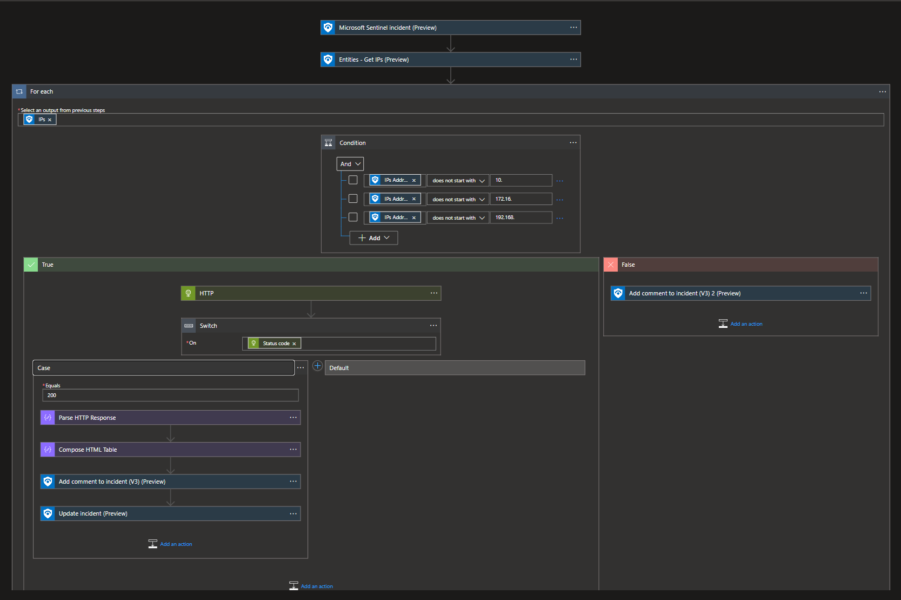

# Incident-IPGeoLocationInfo

Sentinel Playbook to lookup IPv4 and fairly reliable IPv6

1. Deploy from a custom template.
2. Load `azuredeploy.json`.
3. Enter your API key from [ipgeolocation](https://ipgeolocation.io/signup.html).
4. Deploy Resource.
5. Assign System Assign Managed Identity role - `Microsoft Sentinel Responder`
6. Create Sentinel Automation Rule to trigger playbook.

