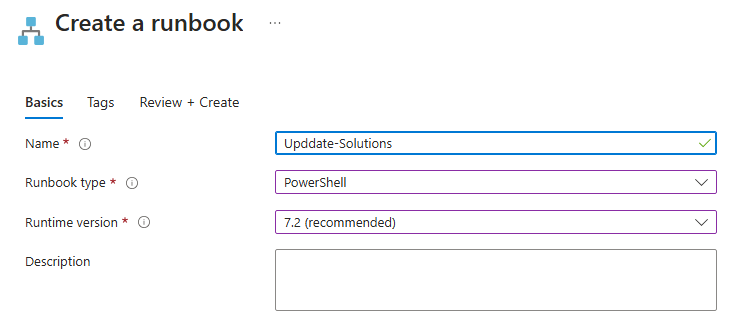
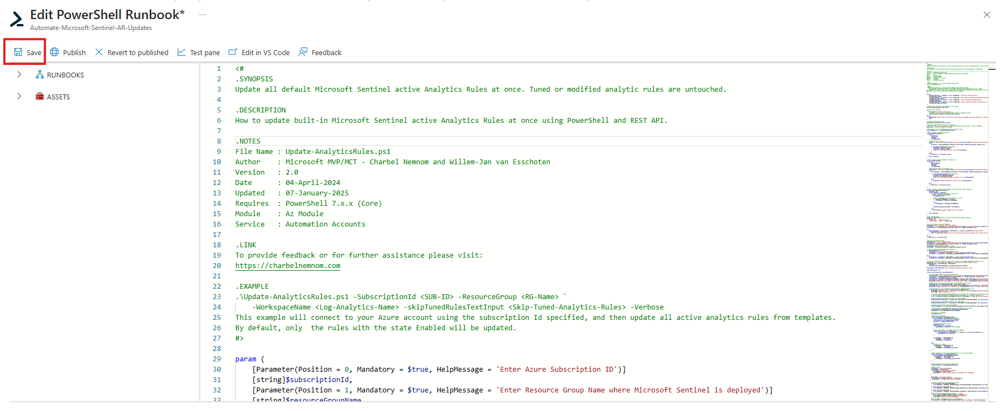
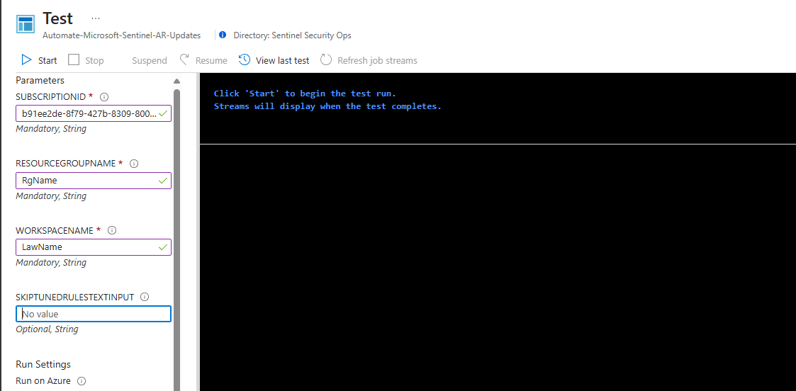

# Automating Microsoft Sentinel Updates

## Overview

This guide provides a step-by-step approach to automating the update of Microsoft Sentinel Resources using Azure Automation Accounts and PowerShell Runbooks.

- Microsoft Sentinel Content Hub Solutions
- Microsoft Sentinel Analytics Rules
- Microsoft Sentinel Workbooks

## Prerequisites

- Azure subscription with Microsoft Sentinel enabled.
- Azure Automation Account.
- Appropriate Azure RBAC permissions.
- PowerShell knowledge for Runbook automation.

## Steps to Automate Sentinel Updates

### Automation Account

Creating an Automation Account generates a new service principal in Microsoft EntraID. Assign the appropriate Azure RBAC role to the service principal at the resource group level where Sentinel is deployed.

- Assign **Microsoft Sentinel Contributor** role to the managed identity at the **resource group level**.
- Always use the **principle of least privilege** when assigning permissions.

### Create an Automation Account with Managed Identity

1. Open the Azure portal.
2. Navigate to **Automation Accounts**.
3. Click **+ Add**, provide the required details, and ensure **System-assigned managed identity** is checked under Advanced.
4. Click **Review + Create** > **Create**.


### Create a PowerShell Runbook

1. Navigate to **Runbooks** under **Process Automation**.
2. Click **+ Create a runbook**.
3. Provide a name and select **PowerShell** as the Runbook type.
4. Choose the **PowerShell 7.2 runtime version**.
5. Click **Review + Create** > **Create**.



### Edit the Runbook

1. Open the newly created Runbook and edit the script.
2. Paste in the script that corresponds to the Automation that you are implementing (Solutions, ARs, Workbooks)
3. Click Save



### Test the Runbook

1. Open the **Test pane**.
2. Provide the required parameters:
   - `SUBSCRIPTIONID`: Mandatory
   - `RESOURCEGROUPNAME`: Mandatory
   - `WORKSPACENAME`: Mandatory
   - `SKIPTUNEDRULESTEXTINPUT`: Optional
3. Click **Start** to execute the automation script.
4. Verify successful execution.



#### Analytical Rule Query filters

The filtered parameter in the script is $skipTunedRulesText, which determines whether certain Microsoft Sentinel analytics rules should be skipped from updates. Below are some possible values for this parameter:

```PowerShell
# Filter out tuned and modified KQL rules (Optional)
if ($skipTunedRulesText -ne "**") {
    Write-Output "Filter out tuned and modified KQL rules..."
    $ruleSkipTuned = $ruleEnabled | Where-Object { $_.query -notlike $skipTunedRulesText }
    $activeRules = $ruleSkipTuned | Where-Object alertRuleTemplateName -ne $null | Select-Object alertRuleTemplateName
}
else {
    $ruleSkipTuned = $ruleEnabled | Where-Object { $_.query -like $skipTunedRulesText }
    $activeRules = $ruleEnabled | Where-Object alertRuleTemplateName -ne $null | Select-Object alertRuleTemplateName
}
```

Possible Values for $skipTunedRulesText

`The keyword must exist in the KQL query to prevent the rule from being updated`

1. Wildcard ** (Double Asterisk)

- If $skipTunedRulesText -eq "**", it means no filtering is applied, and all analytics rules are processed.
- Ths scenario allows updating all active rules, including tuned/modified ones.

2. Specific Keywords or Phrases

- Example: "custom_alert" or "deprecated_rule"
- The script will exclude any rule whose query contains the specified text.
- This is useful if you want to preserve specific tuned rules from being modified.

### Publish the Runbook

Once testing is successful, click **Publish** to finalise the Runbook.

### Schedule the Runbook

1. Open the Runbook and navigate to **Schedules**.
2. Click **+ Add Schedule**.
3. Set the recurrence:
   - **Recur every 1 Week** (or as needed).
   - **Set expiration to No**.
   - **Run every 1 hour** for more frequent updates.
4. Click **Create**.


### Monitor Runbook Execution

1. Open **Jobs** under **Runbooks**.
2. Monitor **Output, Errors, Warnings, and Logs**.
3. Validate that the automation runs as expected.

## Summary

This guide demonstrated how to:

- Create and configure an Azure Automation Account.
- Assign the necessary RBAC roles.
- Use PowerShell Runbooks to update Microsoft Sentinel Analytics Rules.
- Automate the update process using schedules.
- Monitor and validate the automation.

Using **PowerShell and REST API**, you can efficiently manage Microsoft Sentinel Analytics Rules at scale, ensuring that your security monitoring remains up to date.

## Credits

- [Charbel Nemnom](https://charbelnemnom.com/update-microsoft-sentinel-analytics-rules/)

### References

For additional details, refer to:

- [Microsoft Sentinel Documentation](https://docs.microsoft.com/en-us/azure/sentinel/)
- [Azure Automation Documentation](https://docs.microsoft.com/en-us/azure/automation/)
